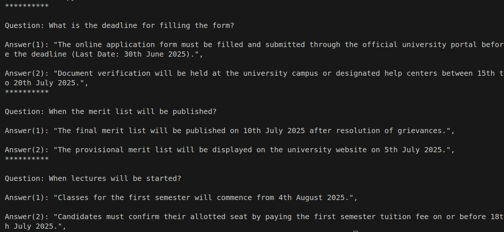

# Similarity-search based QA using Vector DB - chroma 

---

## 📘 Features

- Text similarity search from file to find the closest match answers for a given question
- Embeddings representation using vector db
- Persistance and non-persistance representation
- Retrieve the closest match answer from the file

## ⚙️ How to Run

### 1. Clone the Repository
```
$ git clone https://github.com/pandyahariom/ai-chroma-similarity-search.git
```

### 2.Set Up the Virtual Environment
```
$ python3 -m venv ai
$ source ai/bin/activate
```

### 3.Install the dependencies
```
$ pip install -r requirements.txt
```

### 4.Execute the code locally
```
$ python3 main.py
```

## 🖼️ Expected Output

  Below is an example of how the retrival of similar documents works for a given query and text file:

  
  
  


